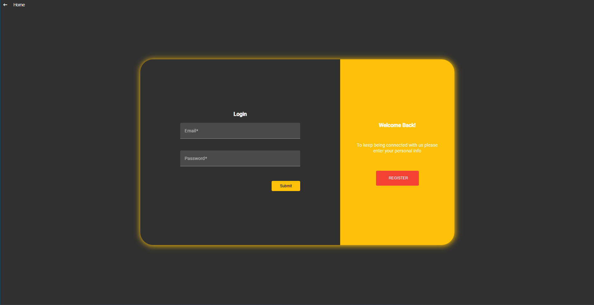
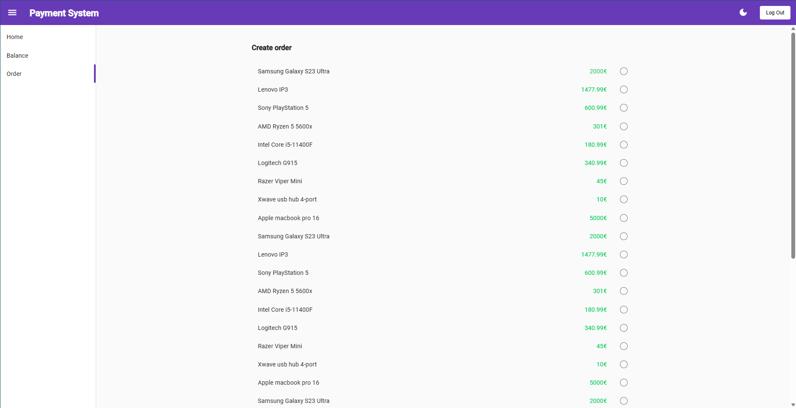
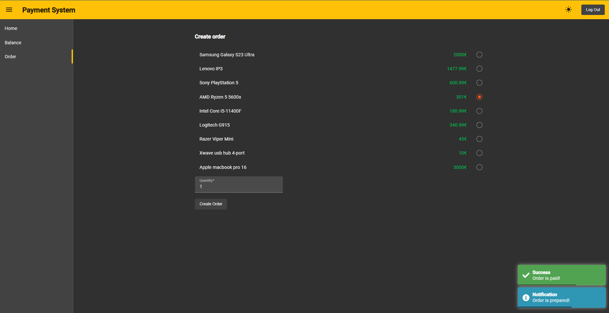
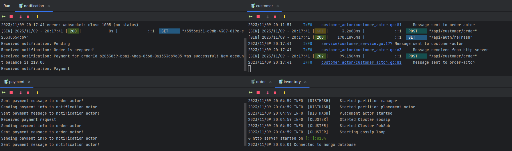

<h1 align="center">
  <a href="https://github.com/MarkoUljarevic/client-shipment-monitoring-actors">
  Client shipment monitoring
  </a>
</h1>

  <a href="#about"><strong>Explore the screenshots »</strong></a>
   
   

Table of Contents

- [About](#about)
  - [Built With](#built-with)
- [Getting Started](#getting-started)
  - [Prerequisites](#prerequisites)
  - [Installation](#installation)
- [Usage](#usage)
- [Authors](#authors)

---

## About
This project was developed as a part of the Distributed Artificial Intelligence and Intelligent Agents course at the Faculty of Techical Sciences in a team of 5 people. The idea of this project was to create a distributed actor system where actors communicate from different computers in the network to solve tasks. We designed a simple yet effective system for tracking the flow of orders to demonstrate the work of actors.
 

Application uses five different actors (*customer*, *inventory*, *notification*, *order* and *payment*) where customer actor not only handles customer-related tasks but also functions as an HTTP server to interact with client. Due to the assumption that most resource-intensive operations will be related to inventory management, inventory actor is designed as a cluster of three actors. This cluster is optimized to handle high-demand tasks efficiently.

Screenshots

 

| Login Page | Order Page |
| :-: | :--: |
|  |  |

| Ordering Process | Actors Consoles |
| :-: | :-: |
|  |  |

### Built With
- [Go](https://go.dev/)
- [Proto Actor](https://github.com/asynkron/protoactor-go)
- [Gin Web Framework](https://gin-gonic.com/)
- [MongoDB](https://mongodb.com/)
- [CockroachDB](https://cockroachlabs.com/)
- [Angular](https://angular.io/)

[ <a href="#table-of-contents">↑ Back to top ↑</a> ]

## Getting Started

### Prerequisites

- **Go Programming Language**: You'll need Go installed to build and run actors. If you haven't installed Go, you can find installation instructions [here](https://go.dev/doc/install)
- **MongoDB**: Ensure that MongoDB's *mongod* process is running on the default port 27017. If you're new to MongoDB, here's a [tutorial](https://www.mongodb.com/docs/manual/tutorial/) page
- **CockroachDB Cloud Server**: This project requires a CockroachDB cloud server. Make sure you have an active CockroachDB cloud server ready. If you're new to CockroachDB, you can follow [these](https://cockroachlabs.com/docs/stable/build-a-go-app-with-cockroachdb#create-a-free-cluster) steps
- **Node.js**: Node.js is essential for starting Angular projects. If you haven't installed Node.js, you can find installation instructions [here](https://nodejs.org)

### Installation

After you install all prerequisites, you need to modify **app.env** file in *Go* subdirectory.

- First, you will enter CockroachDB cloud credentials after you successfully created cluster
- After that, you'll need to genereate private and public keys for access and refresh tokens. In case you don't know how to do that, follow these steps:
  1. Go to Online RSA Key Generator, [e.g.](https://travistidwell.com/jsencrypt/demo/) and generate keys using 4096 bit key size. This process may take a moment, so please be patient while generating the keys.
  2. Once generated, visit [Base64 Encoding Site](https://www.base64encode.org/). Convert both the private and public keys separately to Base64 encoding and enter them as access token in **app.env** file.
  3. Repeat steps 1 and 2 to generate keys for the refresh token.

**By default, all actors are set to run on the local address with preconfigured ports on a single computer. If you want to run actors on multiple computers:**
  1. Open the **app.env** file
  2. Enter the IP addresses of the computers where you want to run the actors
  3. Optionally, change the port numbers if needed

[ <a href="#table-of-contents">↑ Back to top ↑</a> ]

## Usage

**Running the Angular app**
- Open a terminal or command prompt
- Navigate to the *public* subdirectory
- Run `npm install` to install the required dependencies
- Start the Angular server by running `npm start`

 

**Running the Go apps**
- Open a terminal or command prompt
- Navigate to the *Go* subdirectory
- For each of five actors, navigate to their respective subdirectories
- Build each Go application by running `go build`
- Run the compiled Go applications using `./<actor_name>`

Open a web browser and go to `localhost:7000` (7000 is a default port in angular.json). Here you can register, login and use all the features of the application.

[ <a href="#table-of-contents">↑ Back to top ↑</a> ]

## Authors

[ <a href="#table-of-contents">↑ Back to top ↑</a> ]

